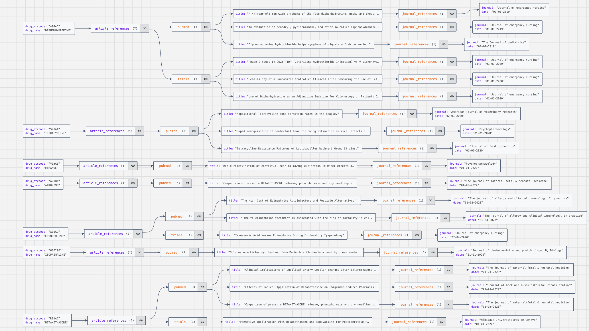

# Drugs referencing application

## Purpose of this application

This application intends to retrieve all the journals and articles' references to a list of drugs
Drugs, articles and journals are listed in local files

## Directory structure

* data
  * clinical_trials: Contains trials files
  * drugs: Contains drugs files
  * pubmed
    * csv: Contains medical publication files with CSV format
    * json: Contains medical publication files with JSON format
* drug_referencing
  * library
    * common_functions.py: Module with general reusable functions
  * drugs.py: Module to manage drugs
  * main.py: Main module to construct the JSON file linking drugs, articles and journals
  * pubmeds.py: Module to manage medical publications
  * trials.py: Module to manage clinical trials

## Requirements

* Python 3
* Packages:
  * All needed packages are built-in Python packages

## Usage

To Run this application, follow these steps:

1. Position yourself within the application folder
2. Create a Python virtual environment:
   1. python3 -m venv venv
   2. source venv/bin/activate
   3. python3 -m pip install -r requirements.txt
3. Execute the application:
   1. python3 drug_referencing/main.py [--journal-ref]

You can access to the helper with the following command:
python3 drug_referencing/main.py --help

**Flags:**

* --journal-ref: Adding this flag while running the application will also execute the function intended to retrieve which journals mention the most drugs

## Expected result

After running the script, several JSON files will be generated:

* drugs_list.json: JSON representing the list of drugs found
* pubmeds_list.json: JSON representing the list of medical publications found
* trials_list.json: JSON representing the list of clinalc trials found
* drugs_references.json: JSON displaying links between drugs, articles and journal
  drugs_references.json can be graphically represented by the following graph:
  

## Adapt fur high volumetry

To manage big files or high volumetry, it is important to consider the available memory that can be allocated to the process.

Therefore, taking that into account, there are several ways to manage such files :

1. Execute the program on a machine with huge capabilities (eg: Google Compute Engine or Kubernetes). The advantage is that it does not require any code modification. The main downside is the run time that is expected to take way longer.
2. Use library like Pyspark to manage big amount of data. It would require many modifications in the code to use Pyspark to process data instead of in memory Python objects. It would also require an infrastructure providing suficient resources. You may also use Google Dataproc to host Pyspark process.
3. Use GCP services specialized for ELT processes. The most prevaliant tool to manage this case is Dataflow that would read files stored on Google Cloud Storage, transform it using Dataflow parallelization and either load the results in a file or in a database. This requires a lot of modifications to adapt the code and use Apache Beam framework.
4. Load the files in a database and make ETL processes within queries. You may use BigQuery as a Database and source an external table with files stored in Google Cloud Storage and set up queries or stored procedures to manage the needed transformation and output results in a table.